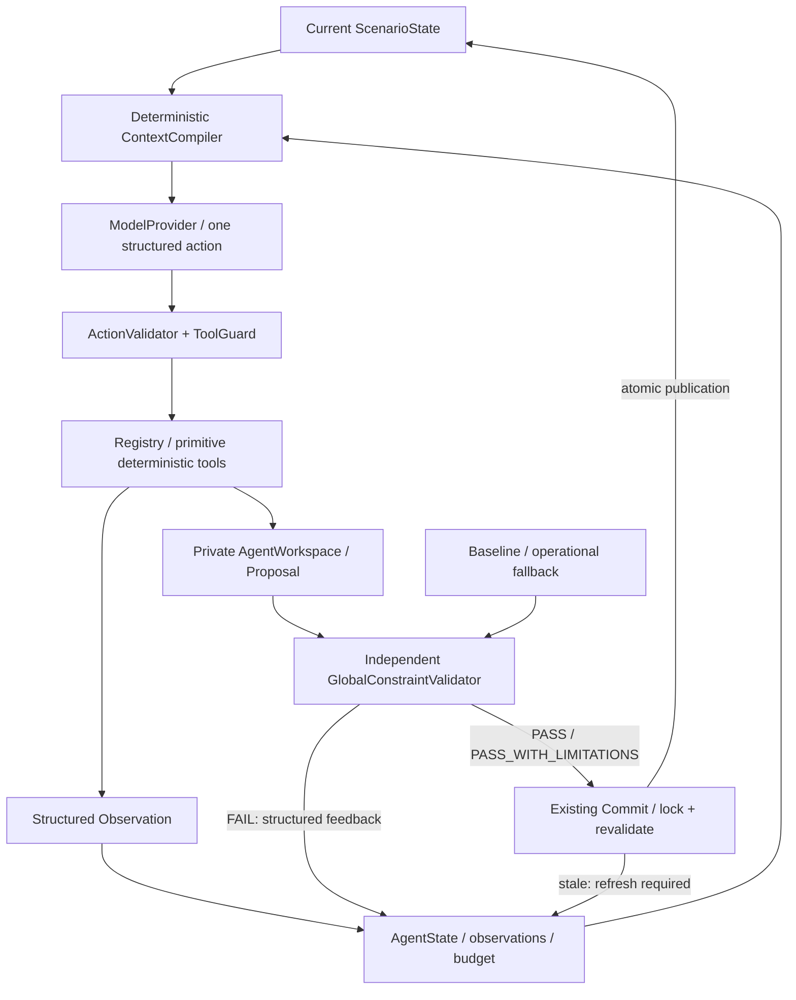

# Phase 5：模型策略与确定性工具闭环

更新：Phase 5.1 已在此基础上增加稳定 option_id、只读 DecisionSnapshot、DominanceGuard、
Fast/Strong 路由和自动 finalization。默认 REST 走优化模式，本文的逐工具/option_index 流程保留为
`policy_profile=original` 的兼容与消融合同。新版设计见 [策略优化](agent-policy-optimization.md)，
重复在线结果及遗留问题见 [Phase 5.1 报告](phase5.1-report.md)。

Phase 5 在现有确定性能力之上增加可替换的策略层。确定性分层规划器对固定问题快且稳定；
Agent 的目标是支持不同工具路径、验证反馈、范围修正与重新决策。完成相同简单修复不构成优越性证据。



## 控制与状态边界

`ScenarioState` 表示真实事件观测和已提交规划；`AgentState` 表示本次决策过程。
AgentState 保存 run/session/reconstruction ID、版本、目标、当前 scope、私有 proposal、观察历史、
权威反馈、预算计数和终止原因。两者通过快照隔离，不共享可写节点/任务对象。

`AgentWorkspace` 持有 base、working、scope、proposal 和 validation fingerprint。
工具只改 working；每次计划修改用原 P3 `describe_delta`、成本计算和严格 Proposal 合同，
相对不可变 base 重新生成唯一 proposal_id。任何修改都会清除原 PASS 授权。
`discard_working_proposal` 丢弃全部私有 delta，保留本次明确批准的 scope 扩展；不影响会话。

P4 现有 validator 要求 `strategy_name=HIERARCHICAL_BOUNDED_BACKTRACKING`（或无修改标签）；
为了不改变 P4 合同，Agent Proposal 保留此遗留元数据标签。真实控制者看外层
`trace.policy_mode` 与 `AGENT_SELECTED_PRIMITIVE_OPERATIONS`，不能从该 legacy 字段推断调用了分层基线。

## Provider 与配置

`ModelProvider.generate_action(context, tool_schemas, timeout_seconds, max_attempts)` 不含领域求解逻辑。

- `MockModelProvider`：显式动作序列，测试可通过回调断言上轮反馈再给动作；序列用完是模型错误。
- `OpenAICompatibleProvider`：HTTP Chat Completions、严格 JSON Schema、关闭思考、低温度。
  仅从 `MODEL_API_KEY` 读取密钥，不记录 HTTP body/headers/private reasoning；网络错误/429/5xx 有界重试。
  不依赖 OpenAI SDK，兼容服务只需替换配置和 transport；其他服务若不支持 schema/enable_thinking，
  配置 `structured_output=json_object`、`enable_thinking=null`，本地严格校验仍强制执行。

默认阿里云北京 OpenAI-compatible endpoint 与 `qwen3.8-max`，已通过实际账号模型列表和调用验证。
最新型号依据 [阿里云文本生成模型文档](https://help.aliyun.com/zh/model-studio/text-generation-model)，
结构化输出依据 [阿里云结构化输出说明](https://help.aliyun.com/zh/model-studio/qwen-structured-output)，
非思考设置依据 [深度思考说明](https://help.aliyun.com/zh/model-studio/deep-thinking)。
模型可变，论文复现应固定快照而非滚动别名。

`config/agent.json` 无密钥；环境覆盖 `MODEL_PROVIDER / MODEL_BASE_URL / MODEL_NAME /
MODEL_TIMEOUT_SECONDS / MODEL_MAX_RETRIES / MODEL_TEMPERATURE / AGENT_FALLBACK_ENABLED`。
`.env.example` 是说明文件，不会自动加载。显式启动参数 `--credentials-file docs/API`
由 launcher 读取单行密钥到进程环境；核心 Provider 不知道本地文件位置。凭据文件和 `.env` 被忽略。

默认预算：16 次 Agent 决策、20 次模型 HTTP 尝试（含重试）、首次验证后最多 3 次再验证、
2 次 stale restart、120 秒总预算、连续非法动作最多 2 次修正机会；fallback 关闭。
循环在发模型请求、执行工具前检查时间；HTTP 使用剩余预算，工具沿用 P3 有界搜索配置。
这是合作式预算，正在运行的有界工具/原子事务不会被后台线程强杀，不承诺精确硬实时截止。
总预算耗尽后不再启动 fallback；单次模型超时但尚有总预算时可按配置 fallback。

## Context Compiler

不使用模型摘要。输入相同（包含显式 elapsed_seconds）则结构化输出相同。
按 FAIL、DEGRADED、INFO，随后任务优先级、截止时间和 ID 排序；候选优先共享节点、相关任务、距离和 ID。
包含当前状态摘要、累计事件、能力缺口、当前 scope、其他编队能力事实、候选摘要、最近工具观察、
权威验证反馈、proposal 摘要、版本/digest、可用工具、已用预算。
不提供整个 60 节点列表、完整地图航迹或无限历史；编队能力摘要不是可行性承诺，仍需工具检查窗口/资源。

默认最多 8 个受影响任务、6 个候选/其他编队摘要、5 步观察、12 条违规、14,000 个序列化字符。
超额按完整结构项删除，先旧观察，再候选/其他编队、旧事件、低优先违规和任务；保留控制元数据和最新反馈尽可能久。
`truncation` 记录初始条数限制及字符截断标志。字符上限是 context 的上限，不包含固定系统指令和工具 schema。
token_estimate 仅是估计，真实 token_usage 取 Provider 回传值。需要更多细节时模型可调用 inspect/query。
任务名称/描述不当指令注入；领域描述标为 `UNTRUSTED DOMAIN DATA`，任务摘要默认只使用结构化事实。

## Action 与 Guard

动作例子：

```json
{
  "action_type": "CALL_TOOL",
  "tool_name": "try_in_place_repair",
  "arguments": {"task_id": "T03", "option_index": 0},
  "target_entities": ["task:T03"],
  "decision_reason": "工具确认中继缺口，尝试保持任务归属的局部修复。",
  "expected_effect": "生成私有候选方案，随后独立验证。",
  "evidence_refs": []
}
```

`decision_reason` 是短审计理由，不是可执行事实或私有思维链。云端强制 schema 后仍做本地严格
Pydantic 校验；拒绝多余字段、错误类型、非法 ID、未知工具和参数。每个工具有独立参数 schema。
动作可用 CALL_TOOL / VALIDATE / COMMIT / STOP；USE_FALLBACK 在正常 Agent 模式被 Guard 拒绝。
字符串 `"0"` 不能冒充整数 option_index。

模型不能提供任意 Python、SQL、节点状态、约束削弱、路线坐标或任意 delta。
目标任务必须存在；修改范围外任务先调用 scope 工具。模型即使声称 PASS 也不能授权 commit：
必须存在真正 Validator 结果、proposal_id 匹配、完整规范化 proposal 内容 hash 匹配。
事务仍在锁内重新验证，独立于 Agent 的缓存 PASS。旧版本或 digest 不匹配不能强制覆盖。

## 工具表

| 工具 | 参数 | 行为 |
|---|---|---|
| get_current_state_summary | 无 | 当前版本/digest；必要时刷新并丢弃旧方案 |
| get_outstanding_violations | 无 | 当前私有计划的真实全局 mission 违规 |
| inspect_task_state | task_id | 能力/资源/编队/路线/时间与共享任务事实 |
| generate_candidates | task_id, level | 复用候选器；只查询，不调用组合 Solver |
| try_in_place_repair | task_id, option_index=0 | 只做 L1，将指定可行 option 应用到私有计划 |
| find_task_reassignment | 同上 | 只做 L2，允许直接跳级 |
| try_formation_reconstruction | 同上 | 只做 L3 |
| detect_route_impacts | task_ids 或 null | 几何影响查询，不规划 |
| replan_route | task_id | 从真实状态构建请求，调用原 A*，私有应用 |
| request_scope_expansion | entity, reason, source_validation_id 或 null | 明确扩展与审计；latest 可引用最近反馈 |
| discard_working_proposal | 无 | 回到 base，保留 scope 扩展，重新选 option |
| validate_proposal | 无 | 针对真实当前会话运行 P4 验证 |
| commit_validated_proposal | 无 | 原事务入口，重新验证后原子提交 |

Solver 失败不执行另一层；下一次调用只能来自 Provider。返回 options 的排序、选中的节点、
availability、rank 和 search_complete 让模型可以改选。option_index 对当前 working 状态的
本次 Solver 结果有效；要替换已选的健康成员，应先 discard，再选择其他 option。
Scope 扩展由模型请求并记录 entity/reason/source_validation_id；新增 spare/form/route 的直接
delta 依赖由组装器解释，不能自动把 unrelated task regression 标为已批准。

## 反馈、版本与终止

Validator FAIL → Observation 中真实 hard_failures/codes/subjects → 下一轮 context →
模型 inspect / 扩范围 / discard / 换 option 或策略 → 新 Proposal → 再验证。
验证结果不修复方案，不改变约束。既支持本次工具生成 Proposal，也接受类型化的外部 initial_proposal
用于审查；初始方案必须通过结构 materialization，不能改观测事实，但不要求预先全局可行。

stale 在验证或提交处产生反馈；只有 `get_current_state_summary` 可以解除 needs_refresh。
刷新重建 scope/base、丢弃旧工作方案和 PASS，受 max_stale_restarts 限制。不会把旧 delta 套到新版本。

成功提交立即终止 SUCCESS；没有 receipt 的 STOP SUCCESS 被拒绝。
STOP NO_RECONSTRUCTION_REQUIRED 重新检查原观测态与当前版本，不能拿未提交的 working 可行性冒充完成。
INFEASIBLE 是策略在已探索空间中的停止判断，不是数学上的全局无解证明。

完整终止码包括 SUCCESS、NO_RECONSTRUCTION_REQUIRED、INFEASIBLE、MAX_STEPS_REACHED、
MAX_MODEL_CALLS_REACHED、VALIDATION_RETRY_LIMIT、TIME_BUDGET_EXCEEDED、MODEL_ERROR、TOOL_ERROR、
STALE_RESTART_LIMIT、FALLBACK_SUCCESS/FAILED、DETERMINISTIC_SUCCESS/FAILED。

Fallback 只在配置允许的模型/非法输出/步骤或调用预算/致命工具错误后启动，并且尚有总预算。
显式 mode=deterministic 不叫 fallback。fallback 丢弃私有计划，基于当前观测态调用 baseline，
trace 明确保存 Agent 原始失败、fallback_reason、基线结果；不伪装成 Agent 成功。

## Trace、API 与评测

Trace 每步保存 context hash/大小/任务 ID/截断信息、模型名/延迟/usage、类型化 action、工具参数、
observation、权威 validation feedback、版本和 proposal_id；外层保存 scope 扩展和终止。
不保存完整模型 prompt、原始响应、Authorization、密钥或 reasoning_content。字符串也做凭据脱敏。
审计理由可能和参数不一致，必须以实际参数/工具结果/receipt 为准。

REST 只是入口：`POST /api/v1/agent/reconstruct`，参数 session_id、expected_version、mode，
可选 objective、initial_proposal。`GET /api/v1/agent/runs/{agent_run_id}` 读取本次轨迹。
成功 receipt 的 reconstruction_id 还可读取原 P4 全链路结果。测试通过 create_app 的 provider factory 注入 Mock。
HTTP 与核心循环无协议依赖，未实现 MCP。结果和会话都仅存单进程内存，重启丢失。

初步对比用相同初始 digest 的独立会话，各执行一次 Agent 和 baseline，记录恢复任务、验证成功、
工具调用、实际 Solver 调用、验证重试、扰动向量、航迹变更、模型和总延迟。
baseline 直接调 Solver，不经过 Agent registry，所以 tool_calls=0 不能解释为没有计算。
计数器通过测试式 wrapper 测量实际 Solver 入口，不从固定层数猜测次数。
外部诊断 seed 的构造在 Agent 计时外并单独记录；失败 baseline 的 cost 只是未提交方案成本。
数据见 [Phase 5 报告](phase5-report.md)，不做显著性或 Agent 优越性断言。
