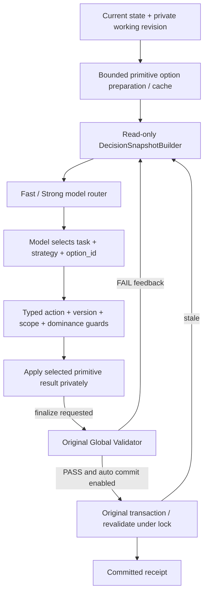

# Phase 5.1：低调用次数的约束增强策略层

Phase 5.1 保留 P1–P4 算法和 P5 的 Provider、工作副本、反馈和事务边界。
原 P5 `AgentReconstructionOrchestrator` 继续用于兼容和消融；新增
`OptimizedAgentOrchestrator` 承担生产默认的优化策略循环。两者都不能绕过 P4 验证/提交。

## 决策与机械步骤分离

模型负责选择任务、策略、具体选项、范围扩展以及失败后的修正；软件负责廉价事实查询、类型检查、
版本保护、明确授权后的全局验证和事务提交。模型仍可以直接 L2/L3，普通工具表里没有完整 reconstruct()。



`finalize=true` 是模型认为方案完整、申请完成重构的显式动作。软件自动执行不可省略的 Validator，
PASS 后按配置 Commit，没有替模型决定方案。FAIL 时软件只回传事实，不换层、不改选、不自动扩大 scope。
`AUTO_COMMIT_AFTER_VALIDATION=false` 返回 `VALIDATED_NOT_COMMITTED`，保留可供原 P4 接口显式提交的 Proposal。

## Stable option 合同

`ReconstructionOption` 记录 option_id、option_set_id、世界版本/摘要、工作修订号/摘要、策略、目标任务/编队、
本选项新增/移除节点、能力/资源/航迹效果、累计规划 delta 摘要、原字典序扰动向量、资格和解释。
option ID 根据当前 option set、策略和真实 primitive option 的规范化内容生成，不依赖列表位置。

工作修订是私有计划的单调计数，与 ScenarioState.version 分开。应用、discard、refresh、scope 改动和
安装外部初始 Proposal 都会改变修订。即使 discard 后世界数据恢复成相同内容，旧 ID 也不会复活。
重新查询同一个修订得到相同 ID；新事件、工作修订、scope 或当前 option set 不匹配返回 `STALE_OPTION`。
不存在的 ID 返回 `UNKNOWN_OPTION`，不再用 OPTION_INDEX_OUT_OF_RANGE 解释陈旧状态。

新模型工具表没有 option_index。选择方式：

```json
{
  "action_type": "SELECT_OPTION",
  "option_id": "从当前Snapshot复制的精确ID",
  "tool_name": null,
  "arguments": {},
  "scope_expansions": [],
  "finalize": true,
  "decision_reason": "选择当前硬约束可恢复且字典序扰动最小的选项。"
}
```

`CALL_TOOL apply_reconstruction_option` 也接受 option_id。原 L1/L2/L3 primitive 保留；新模型表中的
对应工具返回本层稳定选项，只有明确选中 ID 才应用。`get_reconstruction_options` 可以独立查询过滤选项。
路线仍使用 `CALL_TOOL replan_route`，可附 finalize=true；路线坐标由原工具求解。

权威验证失败时记录的 working 内容摘要仍匹配当前私有计划时，候选准备可生成 `replaces_working_proposal=true` 的选项，
明确表示基于观测 base 重做整个私有方案。模型可以在同一动作中申请 scope_expansions 并选择替代选项。
所有扩展引用、ID、范围和支配检查先通过，才执行这组私有变更；服务器不偷偷修改模型给出的 ID。
仅改 scope 会更新 proposal_id，但不会清除被拒绝方案的内容关联；否则会在多轮扩范围后丢失替换语义。
反馈还带 `applies_to_current_plan`：保留旧 FAIL 供审计，但替换方案后明确标为历史反馈。
新工作方案显示 `NOT_VALIDATED`，避免模型把旧方案失败误读为新方案失败而不断 refresh。
Delta Context 对已失效反馈只保留 `SUPERSEDED_BY_CURRENT_PLAN` 历史引用，不再把旧硬失败明细当成当前输入；
完整反馈仍保存在 DecisionSnapshot 和 PolicyDecisionRecord 中，保持审计可追溯。

## Snapshot 与候选准备的实际成本

DecisionSnapshotBuilder 本身只读，汇总当前违规、任务缺口、路线冲突、候选摘要、稳定选项及成本、
共享备用节点、工作方案、scope 和验证反馈。它不调用 Solver，不选择执行顺序。

为了首轮就能比较 L1/L2/L3，独立 `OptionCatalog.prepare` 会对当前非航迹缺口预取三类 primitive options。
这不是免费的 Context 优化：每个实际 primitive 调用计入 solver_calls，耗时记录为 option_generation_ms。
不根据 L1 成败决定是否运行 L2/L3，而是平等查询可选能力，模型仍选哪个方案。
当前配置最多 8 个任务、每类显示 4 个选项、Snapshot 最多 16 个选项；底层搜索预算沿用 P3。
同修订复用缓存；纯 route-only 不调用候选/编队/任务重分配 Solver。

跨策略轮转摘要，避免全是第一层的许多近似选项而看不到其他策略；截断数量可见，未显示选项仍可通过工具查询。
成本向量是**实际已物化 delta** 的成本。L2/L3 后尚未求解的路线变化单独以 route_tasks 列出，
不会伪造一个未来 A* 航迹成本；最终真实 route delta 和成本由原 Validator 重算。

## DominanceGuard 的范围

只有同一 option set、同一目标任务，且 A 局部可行时，才比较 A/B：

1. A 的实际字典序扰动向量严格小于 B，不求和、不转成权重分数。
2. A 对全部已评估硬目标的缺口不大于 B：能力/资源数值缺口、成员不可用、编队/路线等失败均计入。
3. A 留给其他当前未恢复任务的备用机会不劣于 B：按任务窗口计算可用数量、能力、资源，额外保留唯一有用节点身份。

满足时 B 标为 DOMINATED；优化模式拒绝选择并回传 better_options。一个低成本 L1 仍留下其他约束缺口，
不能仅因层级低而禁止能恢复更多约束的 L3。占用另一任务唯一 relay 的低成本选项，也不能据此支配保留 relay 的方案。

这里的支配关系只针对已建模、当前可观测的目标和有限 option 集；不是全局最优证明。
未来 mission policy、真实转场、风险等目标进入模型后，必须扩展比较维度；不能沿用“缺失维度相等”的假设。
当前备用数量/能力是保守机会摘要，不证明未来多任务所有组合都有解。

## Delta Context 与 PromptSizeMetrics

首轮 BaseDecisionContext 给出目标、成本顺序、任务静态摘要、当前事实与选项。
后续 IncrementalObservation 只保留当前违规/任务缺口、工作方案、scope 变化、最后一次观察、真实反馈、
当前选项和预算。当前使用无服务器会话状态的 Chat Completions，因此每轮仍带足够的独立控制信息，
不会把必要事实藏在一个并不存在的远端 memory 里。

严格 action schema 放在 response_format 中；工具消息只保留短用途，不再复制同一套参数 schema，
系统指令也不重复嵌入完整 action schema。json_object 兼容模式会补 schema 文本，仍做本地严格校验。
默认 context 上限 9,000 字符，按完整结构项截断并标记；API request 的完整大小另行记录。

PromptSizeMetrics 分开保存 system_chars、tool_schema_chars、action_schema_chars、context_chars、history_chars、
request_chars、estimated_input_tokens。context_chars 不重复计 history_chars。token 估计只是字符近似，
真实输入/输出 token 数取云 API usage，失败且未返回 usage 的请求不能假装测到了 token。

## Fast / Strong 模型路由

Router 仅选择本轮 Provider，不能选择重构策略。
简单单缺口、route-only、明确非支配选项优先 fast；共享候选竞争、真实验证反馈、需要扩范围、多个非支配策略、
连续非法动作等用 strong。连续两次非法动作可升级，仍受原连续错误上限约束。

`FAST_MODEL_NAME` / `STRONG_MODEL_NAME` 支持独立配置，也接受 FAST_POLICY_MODEL / STRONG_POLICY_MODEL 别名；
两个值可相同。当前默认 fast=qwen3.8-flash、strong=qwen3.8-max，型号只出现在配置，路由不含厂商判断。
阿里云 [Flash 模型说明](https://help.aliyun.com/zh/model-studio/qwen3-8-flash) 和
[结构化输出说明](https://help.aliyun.com/zh/model-studio/qwen-structured-output) 支持当前选择；实际可用性已在线验证。

## 模式与预算

| AGENT_EXECUTION_MODE / API mode | 行为 |
|---|---|
| adaptive_agent | 模型真实选方案，按正常步骤/调用/总预算运行，fallback 默认关闭 |
| bounded_agent | 默认最多 2 次模型尝试、5 秒 Agent 预算；未完成则在剩余总预算内显式 deterministic fallback |
| deterministic_realtime | 直接运行原 baseline，不调用模型，也不冒充 Agent 成功 |

旧 API mode=agent 使用配置模式；mode=deterministic 继续指向 baseline。
decision_time_budget 默认 15 秒，是单个决策节点（准备+context+模型）的预算，独立于总 120 秒及 bounded 的 5 秒。
迟到的模型动作不会应用；已经进入的有界 Solver/原子事务不会被强杀。因此这些是合作式预算，不是硬实时 SLA。
bounded 的 fallback 使用剩余总预算，可能使最终总耗时超过 5 秒；必须同时看 pure_agent_ms、fallback_ms、agent_total_ms。

输出区分 pure_agent_success、fallback_success、overall_success；trace 保存原始失败和 fallback_reason。
原基线无法处理的情形也可能 FALLBACK_FAILED，不能把 fallback 当成任意问题都能保证成功的机制。

## 决策审计与一致性诊断

PolicyDecisionRecord 保存 decision_id、实际模型/路由原因、snapshot hash、选中 ID/工具/目标、扰动成本、
全部预取选项摘要、非支配选项、验证反馈、准备成本、PromptSizeMetrics 和自动验证/提交子步骤。
这使“为什么用了更大扰动”可以回查到当时实际可选的方案，而不只读模型理由。
`automatic_steps` 是本决策动作的聚合记录，主动作置首，不是子步骤时间戳序列；实际执行先通过全部预检，
再完成已批准的 scope 扩展、应用选项、验证和提交。报告示例按实际执行顺序展示。

reason_argument_consistency 是保守的文字诊断：找理由中精确出现的节点 ID，与本选项新增/移除节点比较。
出现选项外节点会标记 REASON_ARGUMENT_INCONSISTENCY；没有节点提及返回 null，表示未评估。
它不做完整自然语言理解，“避免 U1”这类否定或历史提及可能误报，不能据此改参数或拒绝合法方案。
执行权始终来自结构化 option_id；Guard、工具事实和 Validator 独立判断合法性。

## 复现、消融与证据

```bash
# 完整离线 A/B/C 消融
PYTHONPATH=/tmp/cluster-reconstruction-deps:. python3 -m scripts.benchmark_phase51 \
  --provider mock --profiles original,snapshot,optimized --counts 20,20,20,10 \
  --output-dir artifacts/phase51-mock

# 正式优化模式：70 个真实运行，全部记录
PYTHONPATH=/tmp/cluster-reconstruction-deps:. python3 -m scripts.benchmark_phase51 \
  --provider real --profiles optimized --counts 20,20,20,10 --credentials-file docs/API \
  --output-dir artifacts/phase51-online-c

# 较小规模的真实 B 消融
PYTHONPATH=/tmp/cluster-reconstruction-deps:. python3 -m scripts.benchmark_phase51 \
  --provider real --profiles snapshot --counts 10,10,10,5 --credentials-file docs/API \
  --output-dir artifacts/phase51-online-b
```

原始 P5 证据不改写。A=original；B=snapshot（稳定选项，无支配拒绝、显式 validate/commit）；
C=optimized（B + 支配保护 + finalize）。B/C 共用路由和 context 压缩，避免把模型差别混为 finalization 效果。
基准逐条落盘 trials.jsonl，成功失败都保留，输出目录有旧记录时拒绝覆盖。
manifest 记录配置、源码 hash、样本数；summary 使用 nearest-rank p95，失败耗时也进入总体分布。
按原字典序比较 Equal / Agent better / Agent worse，任一方案未提交则 not_comparable。
不同 seed、滚动模型、非隔离开发机和云服务波动均限制结果外推；本阶段仅进行指定四案例评测，未进入 Phase 6。

实测结果、失败试运行、Q1/Q2/Q3 结论见 [Phase 5.1 报告](phase5.1-report.md)。
