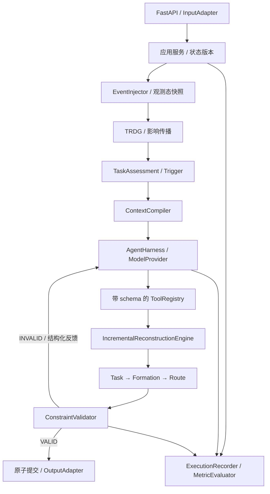
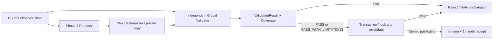

# 集群任务重构智能体：架构与分阶段实施设计

状态：2026-09-24，架构基线 v5.1；已实现 Phase 1–5.1，模型工具闭环、策略优化与事务提交已完成。
本文包含未来阶段规划；当前实现边界详见第 14–16 节及 [Phase 5.1 报告](phase5.1-report.md)。

## 1. 仓库分析与技术选择

初始目录没有源码、README、依赖文件或可复用模型。`.git` 是空的只读占位目录，
不是有效 Git 仓库；不初始化或修改它。环境具备 Python 3.10.12、Pydantic 2，
缺少 FastAPI、Uvicorn、NetworkX。没有发现适用的 AGENTS.md。

采用模块化单体：Python 3.10+、Pydantic 2、FastAPI；Phase 2 引入 NetworkX，
Phase 3 使用可替换的确定性启发式 Solver 和网格 A*，Phase 7 使用 React + SVG。
启发式只承诺可行解与可解释成本，不宣称全局最优。60 节点先以实测决定是否需要
OR-Tools，不预先引入多个 Solver。场景用 JSON，运行记录后续用 JSONL + JSON 快照。

不实现数据库、分布式调度、RAG、训练、多智能体、真实飞控或高保真仿真。

## 2. 完整闭环与依赖方向



依赖约束：所有模块可以依赖 `models`；领域模型不得导入 API、图或模型供应商。
API 依赖应用服务与适配器。图、评估、算法、Validator 相互通过类型化结果交互，
不能读取 API 会话全局变量。NetworkX 只存在于 `TaskReconstructionGraph` 封装内部。
Agent 编排确定性工具，算法不能反向调用 Agent。Recorder 旁路观察，不参与决策。

高层控制允许并列实现：Phase 5 Agent Policy 直接组合 primitive deterministic tools，
产出 Proposal 后经过全局验证与事务提交；DeterministicReconstructionEngine 独立保留为
baseline / model-API fallback / regression test engine / Agent Policy 对比基线。
Agent 不被限制为调用一次完整 reconstruct；两种控制方式共享相同验证和提交边界。
当前薄封装及类型化接口见 [独立能力接口](primitive-interfaces.md)，不涉及 Phase 3 算法重写。

Validator 的聚合能力与几何判定可调用公共纯函数，但不能把 Solver 的“成功”标志
当作校验结果，必须对提交候选状态独立重新计算。

## 3. 领域约定与核心数据结构

坐标采用局部二维米制，时间为场景起点后的秒，窗口为半开区间 `[start,end)`。
优先级 1–5，5 最高；资源是 Demo 的抽象可消耗单位，不冒充真实电量。
能力采用非负可加供给，零项省略；后续非可加能力需显式扩展聚合规则。
实体 ID 在状态内全局唯一，schema_version 与运行 version 分开。

| 模型 | 关键字段 / 语义 | 首次实现 |
|---|---|---|
| ScenarioState | scenario_id、schema_version、seed、version、clock、bounds、六类实体集合 | P1 |
| Capability | id、description、aggregation=sum；这是能力类别定义 | P1 |
| Node | id、position、status、capabilities、health、availability、resource_remaining、risk | P1 |
| Formation | id、node_ids、minimum_capabilities、roles | P1 |
| Task | requirements、resource_required、min_nodes、priority、window、start、target、formation_id、route_id、status | P1 |
| Route | id、waypoints；由 Task.route_id 唯一引用 | P1 |
| EnvironmentConstraint | id、kind、lower、upper、risk；首版轴对齐矩形 | P1 |
| Event | event_id、occurred_at、type 和该类型专用载荷 | P1 |
| ScenarioDefinition | name、description、initial_state、events | P1 |
| ImpactAnalysisResult | event_ids、directly_affected、affected_entities/tasks/formations/routes、levels、propagation_edges、reasons | P2 |
| TaskAssessmentResult | task_id、entity_states、五类 constraint checks、decision、event_ids、reasons、required_actions | P2 |
| TaskReconstructionResult | task_id、old/new_assignment、selected_candidates、cost_breakdown、change_reason | P3 |
| FormationReconstructionResult | task_id、old/new_formation、capability_gap、added/removed_nodes、role_changes | P3 |
| RouteReconstructionResult | route_id、old/new_waypoints、length/risk/deviation、trigger_reason、solver_status | P3 |
| ReconstructionProposal | base_state_version/digest、scope、typed deltas、成本、局部状态、trace；永远不是提交凭证 | P3 |
| ValidationResult | PASS/PASS_WITH_LIMITATIONS/FAIL、逐项 checks、coverage、统计、candidate digest | P4 |
| ReconstructionCommitReceipt | commit/proposal/validation/reconstruction IDs、版本、delta、摘要、时间、replayed | P4 |
| ReconstructionResult | Proposal、Validation、Receipt、State、Event traces、四项确定性耗时 | P4 |
| ExecutionTrace | request_id、step_id、stage、tool_name、typed input/output、status、elapsed_ms、error | P5 |
| PerformanceMetrics | recovery、scope、satisfaction、disruption、各阶段 latency、total_ms、provider_mode | P6 |

结果模型的字段约定在此明确，在负责阶段随着实际算法落成 Pydantic 模型，
避免 Phase 1 提前生成大量没有生产者与消费者的占位类型。

### 单一事实来源

- 成员关系只存于 Formation.node_ids；Node 不重复保存 formation_id。
- 任务分配只存于 Task.formation_id；Formation 不重复保存 task_ids。
- Task.route_id 是路线所有权来源；首版每个任务独占一条路线。
- Formation capability profile 是根据成员状态计算的派生结果，不作为持久化真值。
- Node FAILED 时有效能力为 0；DEGRADED 时为 nominal × health；NORMAL 为 nominal。
- Task.status 表示生命周期 ACTIVE/CANCELLED/ABORTED；KEEP/ADJUST/RECONSTRUCT/ABORT
  是评估建议，不能混用。未恢复任务不能仅因被标为 ABORTED 就通过验收。

### 结构校验与可行性校验

Pydantic 拒绝非法字段、NaN/Infinity、重复 ID、悬空引用、越界坐标、非法矩形、
重复编队成员。无分配任务、空编队、失效但仍分配的节点、航迹终点过期等不可行
状态必须可以入模，由 Assessment / Validator 给出原因；不能在输入层丢弃现场问题。
字典只用于有明确键值 schema 的 capability profile 等映射，不传递任意业务 payload。

8 个任务 / 6 个编队：T01–T06 在第一窗口分别占用 F01–F06；T07/T08 在第二窗口
复用 F01/F02，路径从前一任务终点出发。首版一个节点仅属于一个编队。
任务窗口相交时不允许复用同一编队及其成员；还要检查转场时间、资源累计消耗。
不引入完整时间扩展调度网络，无法满足固定窗口则报告不可行。

### 八类事件

| type | 类型化载荷 |
|---|---|
| NodeFailure | node_id |
| NodeDegradation | node_id、health (0,1) |
| TaskAdd | 完整 Task，可暂时无分配 |
| TaskCancel | task_id |
| TaskPriorityChange | task_id、priority |
| RestrictedAreaAdd | 完整受限矩形 region |
| RestrictedAreaRemove | region_id |
| TargetMove | task_id、target |

使用 discriminated union，禁止自由 dict payload；事件数组按时间非递减排列，
同一时间的输入顺序稳定保留。事件目标存在性、添加/删除顺序及状态转移合法性
由 Phase 2 EventInjector 在变更前校验，Phase 1 不执行事件。

## 4. TRDG 与影响传播

图保存语义关系与传播策略，不能对无类型的双向边直接做全量可达遍历。
`Task requires Capability` 的存储方向不代表影响传播方向。
能力类别 sensor/relay 仅作标签；真正的供给依赖使用 `Node:U17:relay`、
`Formation:F03:relay` 等带作用域的能力实例，避免一个 relay 失效波及全部编队。

规则示例：节点状态 → 本节点能力实例 → 所属编队聚合能力 → 使用该编队的任务。
节点事件不自动标记全部路线，只有结构/起点变化实际使路线失效时才追加路线影响。
Route 依赖环境是几何交集；新增禁区尚无图边，先用包围盒 + 线段矩形相交检测
建立新边，不能只在旧图里找它。移除约束时沿旧边取影响，再移除实体。
TaskCancel 等删除也先读取旧依赖，再修改图。

输出 CRITICAL/AFFECTED/WEAK、传播边、规则名称和理由；不显式列出 UNAFFECTED。
影响集合是检查范围，修改集合由求解结果决定，两者分别记录。
传播设置已访问集合防环；缓存通过 state.version 失效。

## 5. 评估、候选生成与分层重构

每个受影响任务先记录节点/编队/路线实体状态，再分别评估 capability、resource、
formation、route、priority/timing。每个 check 是 PASS/DEGRADED/FAIL 或显式
NOT_APPLICABLE/NOT_EVALUATED（可用于未实现子项）+ 实际值、
阈值、关联实体；最后给出 KEEP/ADJUST/RECONSTRUCT/ABORT 建议。不能用总分掩盖硬约束。
优先级改变可以只调整排序，无需强迫成员和路线变化；取消任务释放资源且不计为恢复失败。
新任务有合法分配需求，即使旧图不存在该任务也要生成重构候选。

CandidateGenerator 顺序筛选：状态 → 可用窗口 → 能力匹配 → 冲突 → 距离/资源/风险，
返回每层数量、排除理由、排序与稳定 ID 平局规则。先尝试空闲节点，再有界扩容。
候选上限不能成为虚假“无解”结论：需报告截断，并在预算内扩大候选后重试。

任务层选择任务保留/重新分配及候选资源约束，编队层用这些约束求具体成员/角色；
两层不能分别分配一遍同一节点。资源预留由重构事务集中管理。
先保留能够满足硬约束的原成员，再补 capability gap，允许一个多能力节点补多个缺口。

Phase 4 修正后的字典序为：任务重分配数、新编队数、改变编队数、成员增删数、
路线变化数、成员归属切换数、移动距离、resource_usage_cost（中性 0）。
剩余资源不是消耗；重构不改变任务 resource_required，也没有增量能耗模型。
旧 resource_cost 保留为 0 以兼容字段。先保证已实现硬约束，
再比较成本；没有任意浮点权重或全局最优保证。失败时保持未受影响
分配不动；若需要借用其他任务资源，必须扩大显式 scope、重新评估受牵连任务并记录理由。

路线只有受限区冲突、端点变化、重新分配或编队变化导致不兼容时才重算。
A* 当前使用长度 + 偏离原路代价，启发式只用距离下界；软风险代价未实现。
按线段检查障碍、对角移动不得穿角；起终点到网格点的连接也必须校验。
受限区边界视为禁止，最终校验连续线段，不只检查离散航点。
新增成员的集合点距离只参与次级成本；物理转场时间与能耗明确 NOT_EVALUATED。

## 6. 增量事务与 Validator

保存三个快照：B（事件前）、O（事件后观测）、C（拟重构候选）。
事件只应用一次：`event_id + 内容摘要` 标识幂等；重复同内容返回已有结果，
同 ID 不同内容返回 409。当前连续事件逐个原子提交；原子 batch 留待扩展。
前端注入后的重构从 O 开始，不能再重复应用事件；无状态请求则从 B 应用事件后开始。

Validator 检查：失效参与、重叠分配、任务能力、编队最低能力、共享资源和窗口、
禁区穿越、活动任务完整分配、起终点一致；对全体状态检查，求解仍然只修改局部。
60 节点的全局校验成本很小，不能用“增量”跳过最终完整性检查。

PASS 或 PASS_WITH_LIMITATIONS 且 base_version/digest 均匹配才提交 C，提交 version+1。
FAIL 返回结构化失败并保留 O；物理失效/环境变化不会回滚至 B。
ProposalMaterializer 只在副本执行类型化 delta；GlobalConstraintValidator 独立计算，
不能调用 Solver/Assessment 作为最终结论；TransactionalReconstructionEngine 在同一锁内
重查版本与摘要、重验候选、准备完整状态与回执后一次替换 SessionRecord。
ABORT 不由重构自动设置。失效后保留观测态是拒绝提交，而非把事实回滚到事件前。

## 7. Agent Harness 与模型边界

ModelProvider 定义 generate / structured_output / tool_call；Phase 5 首先完整实现
一个 OpenAI-compatible provider，未来按实际协议扩展 DeepSeek/Qwen/LocalVLLM。
API Key 从环境变量读取、不入日志；配置提供 base_url、model、timeout、max_rounds。
不能假设所有兼容服务都支持同一种 JSON Schema，要在适配层声明能力并做本地校验。

ContextCompiler 仅提供事件、影响子图、违规、能力缺口、已筛选候选、当前版本、
工具定义及历史工具结果摘要；不上传完整 60 节点场景。设置上下文大小与候选截断标志。

ToolRegistry 注册以下工具，每个工具有 Pydantic 输入/输出、超时、异常类别、耗时：
analyze_task_state、generate_candidates、reallocate_task、analyze_formation、
reconstruct_formation、detect_affected_routes、replan_route、validate_reconstruction。
工具参数必须属于当前事务/scope；未知工具、伪造实体、非法参数拒绝执行。
执行顺序由状态机约束，模型不能跳过验证或自行声称 PASS。

trace 记录 OBSERVATION / ASSESSMENT / DECISION / ACTION / RESULT / VALIDATION，
其中 DECISION 是简明的可见决策依据，不要求或保存模型隐藏思维链。
每轮的真实 Validator violations 返回给模型，下一轮必须改变工具调用或终止。
重复调用循环检测、有限轮数、超时及 provider 异常都有结构化终止状态。

无 API 时算法可独立运行；另设明确标记 `deterministic` 的离线策略用于测试，
不能声称它等于已验证的外部模型。模型模式与降级原因随结果返回。

## 8. API 契约与输入输出适配

当前已实现（保留 Phase 1 请求和快照结构）：

| 方法 | 路径 | 输入 / 输出 |
|---|---|---|
| GET | /api/v1/health | implemented_phase=4，reconstruction_available=true |
| GET | /api/v1/scenarios | 场景摘要列表 |
| POST | /api/v1/scenario/load | `{scenario_id}` → `{session_id,state,events}` |
| GET | /api/v1/scenario/state | `?session_id=...` → 独立场景快照 |
| POST | /api/v1/event/inject | 原有请求结构 → Phase2Result（更新观测态 + 局部评估） |
| POST | /api/v1/assessment | session_id、可选 event_id → 已保存的 Phase2Result |
| POST | /api/v1/reconstruction/propose | session_id、expected_version → 未提交的 ReconstructionProposal |
| POST | /api/v1/reconstruction/validate | session_id、完整 proposal → 只读 ValidationResult |
| POST | /api/v1/reconstruction/commit | session_id、完整 proposal → 重验证并提交，返回 Receipt |
| POST | /api/v1/reconstruct | `{session_id,expected_version,commit?}` 或 `{state,event,commit?}` → ReconstructionResult |
| GET | /api/v1/reconstruction/{id} | 当前进程保存的完整 ReconstructionResult |
| GET | /api/v1/trace/{id} | 同一结果内的事件/影响/评估/方案/验证/提交轨迹 |

`commit` 默认 true；false 只提案与验证。两个输入模型均 extra=forbid，不能混传。
会话接口从当前观测态开始，无状态接口保持事件前 `{state,event}` 契约，在私有事务执行并
返回结果状态（session_id=null），不改变已加载会话。无状态返回 receipt 描述本次私有提交，
不能拿它提交任意已有会话；持久会话的重试应使用 proposal_id 幂等 commit 接口。
Phase 2 按新要求允许连续注入，逐个原子执行并保存版本化事件回执，不覆盖先前影响结果。
Phase 4 从当前状态全量对账累计缺口，历史事件回执提供证据，不能只看最后一个事件。
多浏览器通过 session_id 隔离，首版单进程单 worker，重启清空会话。

结果以 reconstruction_id 关联 proposal、validation、receipt、event_traces、metrics、state。
validate 返回 200 与 ValidationResult；reconstruct 无法提交时返回 200、committed=false 与 FAIL。
独立 commit 验证失败返回 422 VALIDATION_FAILED；版本/摘要不匹配返回 409 STALE_PROPOSAL，
同 proposal_id 不同内容返回 409 PROPOSAL_ID_CONFLICT；不存在返回 404，schema 错误返回 422。

InputAdapter / OutputAdapter 将甲方格式转换为内部 schema；未知输入单位必须显式转换。
若未来新增真正的领域概念仍需版本化核心模型，不能承诺所有需求变化都仅靠两个适配器。

## 9. Evaluation Harness 与性能口径

ScenarioManager 加载显式 JSON 状态，生成器通过局部 Random(seed) 复现备用节点位置。
EventInjector 按序或按 batch 应用；ExecutionRecorder 保存输入、观测/候选/提交状态、
工具实参结果、solver 参数、模型标识、seed、软件版本、校验与性能。
回放默认读取已保存工具结果，不重新调用外部模型；重跑是另一种操作，不能承诺 LLM 确定性。

| 指标 | 固定口径 |
|---|---|
| Task Recovery Rate | 受事件影响且需要恢复的活动任务中最终可执行数 / 需要恢复数；0 分母返回 null |
| Reconstruction Scope Ratio | O → C 改变的唯一实体 ID 数 / O 中实体数；报告新增/删除 ID，避免双重计数 |
| Constraint Satisfaction Rate | 全局最终 PASS check 数 / 全部 check 数；DEGRADED 不算 PASS |
| Plan Disruption Cost | 已实现为结构变化优先的字典序；所有原始计数与中性资源成本均报告 |
| Reconstruction Latency | impact_analysis_ms、agent_planning_ms、task_reconstruction_ms、formation_reconstruction_ms、route_replanning_ms、validation_ms、total_ms |

同时额外报告用户原始口径 `recovered affected / total affected`，明确将取消任务、原本
就可执行的受影响任务如何计入，避免把 KEEP 混入恢复收益。实体分母含哪些类型必须固定，
派生图节点不计为物理状态实体。原始事件造成的变化 B → O 与重构扰动 O → C 分开统计。

total_ms 从状态归一化开始到最终结果记录完成，用单调时钟；包含 provider 网络与重试。
阶段计时不嵌套重复相加，另报未分类 overhead。离线 60 节点 SC04 目标 p95 < 5 s，
报告硬件、重复次数、冷/热启动、p50/p95/max。在线模式另测，不能保证外部 API 总延迟。
完整 Agent 耗时是未来验收指标；当前已有确定性核心实测，见 Phase 4 报告，不含模型 API。

## 10. 推荐目录与阶段验收

```text
backend/app/
  models/           # P1 领域、事件、API；后续按阶段补结果 schema
  adapters/         # P1 输入输出适配
  scenarios/        # P1 场景加载；P2 注入
  api/              # P1 HTTP
  graph/            # P2 TRDG、影响传播
  assessment/       # P2 约束分层评估
  reconstruction/   # P3 solver；P4 materializer/validator/engine/store（独立模块）
  agent/            # P5 providers/tools/context/state/harness
  evaluation/       # P6 record/replay/metrics
backend/tests/
scenarios/
scripts/
docs/
frontend/           # P7 创建
docker/             # P8 按交付需要创建
```

| 阶段 | 具体实现 | 验收与最小示例 |
|---|---|---|
| P1 | schema、SC01 初态、ScenarioManager、基础 API、适配器 | 60/8/6、JSON round-trip、非法引用/载荷拒绝、会话隔离、API 示例 |
| P2 | EventInjector、TRDG、影响传播、Assessment、Trigger | 8 事件单测；U17 影响限定在相关任务；新增禁区能命中旧航迹 |
| P3 | candidates、任务求解、能力编队、局部 A* | 缺口补齐、冲突排除、保持未受影响分配、不可达路径明确失败 |
| P4 | Validator、版本化增量引擎、原子提交/回滚 | 7 类以上违规、旧版本冲突、事件只应用一次、失败保持观测态 |
| P5 | provider、context、tool schema、trace、反馈循环 | mock provider 契约；真实 API 冒烟；畸形工具、超时、修复/停止 |
| P6 | recorder/replay、metrics、SC01–SC04 完整事件 | 固定 seed 可重放；四场景基准；取消/无影响指标边界 |
| P7 | 三栏 + 底部 React/SVG | Load → Inject → INVALID → Run → Before/After → Trace/Validation |
| P8 | 端到端、性能分析、部署与演示脚本 | 真模型/离线分别验收；60 节点性能数据；断网/无解/冲突演示 |

每阶段运行单元测试与最小示例，报告新增文件、实现、测试与未解决问题。
本轮止于 Phase 4，不接模型、Agent Harness、RAG 或前端。

## 11. 主要逻辑缺口与调整结论

1. 8 任务/6 编队缺少时间模型：补固定窗口、转场与资源预算，避免初态即冲突。
2. 共享能力标签造成误传播：类别与供给实例分离，按关系定义传播方向。
3. 新环境不存在旧图边：几何检测独立于图检索，新增/移除使用不同更新顺序。
4. 任务求解和编队求解可能重复占用节点：集中预留，分层输出约束而非各自提交。
5. 纯局部重构可能无解：有界扩容并追踪扩大范围，保持硬约束优先。
6. 事件注入与重构输入可能重复应用：区分无状态 B+event 和会话 O+receipt，事件幂等。
7. `<5s` 与多轮外部 API 延迟矛盾：拆分模式与阶段，基于实测给结论，不伪造 SLA。
8. “只修改适配器”不覆盖新语义：数据格式变化放适配层，领域变化需版本升级。
9. 只用航点避障不可靠：连续线段检测、边界规则与转场可达性纳入校验。
10. 全过程确定性不等于 LLM 可复现：保存工具结果实现回放，将重跑单独标识。

当前仍待业务确认但不阻塞 P1：真实坐标/资源单位、能力是否可加、时间窗口是否硬约束、
是否允许放弃任务、最终模型服务及在线耗时预算。以上按文档中的 Demo 假设实现。

参考：[Pydantic Models](https://docs.pydantic.dev/latest/concepts/models/)、
[FastAPI Testing](https://fastapi.tiangolo.com/tutorial/testing/)。

## 12. Phase 2 已落地的具体语义

详细设计、证据与验收见 [Phase 2 报告](phase2-report.md)。本节对前面的长期架构作当前阶段限定。

- 不修改 Phase 1 的 ScenarioState、Task、Node、Formation、Route 或事件载荷。
  新增 `models/phase2.py` 承载正式事件回执、图快照、影响记录、五类检查、决策和 trace。
- `apply_event(state,event)` 在副本上执行八类 handler，最终校验后 version+1、clock=occurred_at。
  同时刻按 session 锁获取顺序提交；过去时间或旧版本拒绝。同 ID 同内容重试返回历史回执，
  新 ID 对已失败节点再次 NodeFailure 返回 INVALID_TRANSITION。取消保留原分配供审计，
  在评估和资源承诺统计中排除 CANCELLED。没有隐式恢复、重新分配或重新规划。
- 每次构建 before/after 两张 TRDG。全局类别 `capability:relay` 不参与传播；供给采用
  `capability:node:U17:relay` 和 `capability:formation:F03:relay`。图 amount 是状态/健康度
  下的供给快照，不代表具体任务窗口的可用供给，评估器会按窗口独立聚合。
- 传播是有限的关系链，任务是节点失效传播的终点。编队成员关系反向定位所属编队，
  再反向定位使用该编队的任务；改变的能力沿编队作用域供给定位需求任务。
  不遍历类别标签、不传播至其他成员、不因为任务被影响就标记其路线。
  新/旧禁区分别使用新/旧图的连续线段相交边；目标移动仅触及本任务及其路线。
- TaskAdd/Cancel 会影响同编队的活动任务，因为资源承诺可跨不重叠窗口共享；
  PriorityChange 只更新本任务并重评估，未实现调度排序策略不伪造重分配。
  事件推进 clock 时，跨过截止时间的活动任务也加入影响范围，避免过度局部化造成遗漏。
- CRITICAL 表示事实直接变化或截止时间被跨越；AFFECTED 表示需重评估的明确依赖；
  WEAK 留作潜在影响等级，目前没有为凑等级而生成弱影响。任何级别都不是约束 FAIL。
- 五类检查为 capability、resource、formation、route、priority_timing。ACTIVE 任务满足
  已实现硬约束时 KEEP；满足但存在仍参与供给的 DEGRADED 节点时 ADJUST；FAIL 时
  RECONSTRUCT，不推断是否有解。冗余失效节点被排除后仍满足所有最低要求时 KEEP，
  但成员事实状态仍明确记录为 FAILED。ABORT 仅反映输入已有 ABORTED 生命周期。
- priority_timing 检查截止时间及同编队窗口冲突；其 travel_time、priority_policy 子项
  明确 NOT_EVALUATED，`evaluation_complete=false`。NOT_APPLICABLE 用于非活动任务。
  KEEP 只表示已评估约束满足，不代替未来全局 Validator。
- resource 检查本任务可用资源和同编队所有 ACTIVE 任务的资源承诺，不模拟消耗。
  资源按抽象池统计；未建模单节点分摊、转场速度、真实能耗、队形几何或软风险阈值。
- `POST /event/inject` 完成应用/分析/评估后才原子提交，会话记录每个事件结果。
  `POST /assessment` 读取指定事件或最新回执，不再应用事件；回执可能早于当前版本。
  reconstruction_required 仅描述本次受影响任务，不是全局累计故障结论。
- total_phase2_ms 覆盖领域应用、两图构建、影响分析、受影响任务评估、trace/结果构建，
  不含 HTTP 序列化、会话锁等待、外部模型或任何 Solver；时间使用 perf_counter。
  当前 trace 在内存中，示例可导出 JSON；不是完整持久化回放基础设施。

## 13. Phase 3 已落地的具体语义

详见 [Phase 3 报告](phase3-report.md)。`TaskRequirement.from_task` 是只读求解输入快照，
任务需求仍以 Task 为唯一事实来源；图中的 formation-scoped capability 仅是当前分配证据。

ScopeBuilder 在入口显式全量核对当前约束，历史回执只提供 source_events，不复制旧缺口。
该检查用于累计故障对账，Phase 2 的局部评估方式不变。候选搜索/修改只限当前 scope，
正常任务受保护。多任务按 FAIL 项数、priority、deadline、稳定 ID 排序。

采用候选子集搜索 + 跨任务有界回溯；L1 保留健康成员与原编队，移除失效成员并补缺口；
L2 尝试直接接替的已有编队；L3 用自由节点组成新编队。不得抽取其他编队成员，
即使不重叠任务的成员也不跨编队切换，因为当前模型规定静态唯一成员归属。
ReservationLedger 从每个私有候选状态重建，记录归属、窗口和资源池承诺；搜索回退
丢弃分支，不需要回滚真实会话。局部可行性复核使用已实现的 Phase 2 约束。

严格先比较硬约束，再在搜索到的方案之间比较字典序原始成本。只有本层没有完整后续
方案时升级；达到预算也可尝试上层，但必须标注“未证明本层不可行”。结果永远
optimality_proven=false，search_complete 只描述配置策略下的搜索是否耗尽预算。
不穷举正常成员替换、其他编队拆借等超出首版策略的组合。

Task.start 在 L1 为原集合点；L2/L3 的参考起点明确取新成员位置的均值，写入 Task delta。
不伪造物理转场时间。RouteImpactDetector 检查起终点、缺失路线、当前禁区；仅将请求
交给 A*。网格边和精确端点连接均做连续线段碰撞检查，不做未经校验的平滑。
目标是长度 + λ×归一化旧路偏离；λ 与搜索预算集中配置。

`ReconstructionProposal` 返回结构化 delta、局部恢复/剩余检查、成本、策略与完整 trace，
无 session commit；base_version+digest 供 Phase 4 再校验。输入观测态不变，任何
FEASIBLE 仅针对首版局部模型，仍有 travel_time/priority_policy 等未评估项。

## 14. Phase 4 已落地的具体语义



1. `models/phase4.py` 给出正式 ValidationResult、ValidationCoverage、Metrics、Receipt、
   ReconstructionResult 与 API 输入。候选摘要对应提交前的版本；receipt 另记录 version+1 后摘要。
2. `materializer.py` 严格检查 before images、目标 ID、membership 的实际增删、node_changes 与
   编队角色的一致性。只执行 formation membership/roles、task formation_id/start、route 与
   task.route_id；没有节点状态或环境 delta，也不允许改已有编队的 minimum_capabilities。
3. `validator.py` 重算所有 ACTIVE 任务；纯能力聚合和连续几何事实可复用，局部 Solver 和
   Phase 2 Assessment 不能作为校验结论。硬约束失败不会因 solver_status=FEASIBLE 被忽略。
   结构检查后再次验证事实投影、实际 delta、scope 扩展理由、独立成本与策略、路线长度/偏离/
   重规划声明，以及 scope 外原本通过任务的回归。
4. FAILED 成员不计供给，且不得保留在承担 ACTIVE 任务的编队。闲置编队允许原有失败成员
   作为历史计划；新增失败成员或给失败节点分派新 role 始终拒绝。成员窗口必须覆盖整个任务。
   所有编队静态唯一归属，包括闲置编队。共享资源累加全部 ACTIVE 任务的 stock 承诺，
   包括不重叠窗口；没有执行消耗或补给模型，commit 不扣减 observed resource_remaining。
5. PASS 表示适用硬约束均通过且无关键未评估项；有 ACTIVE 任务时通常为 PASS_WITH_LIMITATIONS。
   travel_time、transfer_time、dynamic_energy、formation_geometry、dynamic_scheduling 显式未评估。
   Coverage 的 VALIDATED 表示执行过，可能含失败；前提/结构拒绝后未执行项为 NOT_RUN。
6. `store.py` SessionRecord 将 snapshot、事件历史、幂等映射、重构结果存为一个发布单元。
   `engine.py` 在与 EventInjector 相同的进程 RLock 内重查版本+digest，重新验证并完整构建
   状态/回执/审计，最后单次替换该会话记录。返回副本先于发布构建，错误不留下半套变更。
   全局锁比逐会话锁更保守；Demo 仅支持单进程单 worker，不宣称分布式或磁盘事务。
7. 同 session、同 proposal_id、同规范化内容返回原 receipt，replayed=true；幂等检查先于版本检查，
   因而新事件后也可取回原提交回执。不同内容冲突；未提交的旧版本/digest 返回 STALE_PROPOSAL。
   无 delta 的合法方案若显式提交也产生一个版本，重放同方案则不再递增。
8. DeterministicReconstructionEngine 在锁外求解，锁内权威验证与提交。新事件可在求解时进入，
   提交时拒绝过期结果。commit=false 和失败方案保存诊断结果但不改变 ScenarioState 或事件历史。
   validate 接口只返回验证结果，完全不写会话。`/assessment` 仍是事件当时的历史回执；
   提交后当前重新评估由 `TaskAssessmentEngine.assess(state, full_check=True)` 明确执行。
9. `ReconstructionPrimitives` 独立暴露当前评估、全局 mission 违规、候选生成、L1/L2/L3
   局部 options、路线影响与重规划、验证及提交。每个调用只执行指定能力；是否重试、换层、
   选择哪个 option、何时提交由调用者控制。它不调用完整 hierarchical propose 或 baseline。
   DeterministicReconstructionEngine 的固定策略仅作为 baseline/fallback，未来 Agent Policy
   可在同一确定性能力集合之上采用不同控制策略。
10. reconstruction_id 连接完整 Phase2 event/impact/assessment、Phase3 proposal trace、Phase4
   validation/receipt。内部阶段原始计时均保留。phase4 total 是确定性重构核心耗时，不是 Agent SLA。

真实案例、测试和性能数据见 [Phase 4 报告](phase4-report.md)。Phase 5 将现有 Pydantic
接口封装成工具；Agent 没有直接写 ScenarioState 或跳过 commit 校验的入口。

## 15. Phase 5 已落地的具体语义

`AgentReconstructionOrchestrator` 独立于 REST，直接调用 `ReconstructionPrimitives`。
ModelProvider 每轮只给出一个严格结构化动作；候选、L1、L2、L3、航迹工具均不自动升级，
顺序和 option_index 由模型决定。AgentWorkspace 保存私有计划，不修改事件观测态。

ContextCompiler 用确定性排序和结构化截断汇总当前缺口、共享编队、候选、最近反馈、版本与预算。
Tool Registry / Guard 检查动作 schema、实体、scope、stale 和权威验证。
所有修改最终仍进入 Phase 4 的 ProposalMaterializer / GlobalConstraintValidator / 原子 Commit。
验证失败回传完整结构化硬失败；模型可显式扩 scope、废弃私有方案、更换 option 或策略、重新验证。
新事件导致版本/摘要不匹配时，旧方案失效，模型必须主动 refresh 后重规划。

默认 `qwen3.8-max`、非思考模式、temperature=0、严格 JSON Schema；HTTP transport 可替换。
MockModelProvider 是显式测试脚本，不伪装成模型推理。Baseline 仅在显式 deterministic 模式或
配置允许的运行故障 fallback 中调用；不出现在普通 Agent 工具表中。

真实四案例均提交成功，无 fallback；双故障案例模型产生了比 baseline 更大的扰动，反馈案例
也发生了重复坏选择及非法 option_index，均在独立验证/Guard 边界被挡住。详细证据、测量口径、
局限与后续建议见 [Agent 架构](agent-architecture.md) 和 [Phase 5 报告](phase5-report.md)。
## 16. Phase 5.1 策略优化

稳定选项绑定世界版本/digest 与私有 working revision，替代模型的 option_index 选择。
只读 Snapshot 汇总独立、可计时的 primitive 选项准备结果；模型自主选择，DominanceGuard 只根据
实际硬约束缺口、其他任务候选机会和字典序成本拒绝严格劣势选项，不按层级硬编码。
模型 finalize 请求后执行原独立验证、锁内重验和提交；FAIL 反馈返回模型，不自动选择另一层策略。

失败方案用 working 内容摘要跟踪，因此单独扩 scope 造成 proposal_id 变化也不会丢失替换语义。
Delta Context 删除静态重复字段，严格响应 schema 不再在 prompt 重复粘贴；PromptSizeMetrics 单独计量。
Fast/Strong Router 只选模型，不选 L1/L2/L3；adaptive / bounded / deterministic_realtime 模式明确区分
纯 Agent 成功、fallback 成功与总体成功。预算不是硬实时保证。

原 Phase 5 证据保留，正式重复基准和缺陷发现批次都保留。接口与保护定义见
[agent-policy-optimization.md](agent-policy-optimization.md)。本轮没有进入 Phase 6。
# Phase 6 增量交付说明

当前增加独立应用服务与 Web Demo：`React/SVG → REST Demo Adapter → DemoApplicationService → 原 P2–P5.1 能力`。
应用层代码位于 `backend/app/demo/`，负责固定场景、事件注入、真实展示投影、异步运行、私有分支预览、现场原 P4 事务提交和持久化运行回放。P2–P4 核心与 Agent Policy 未重写。

三种模式为 `adaptive_agent`、`bounded_agent`、`deterministic_realtime`；模型直接编排原 primitive，确定性引擎仍为 baseline/fallback。Step Mode 的内部求解发生在隔离分支，只有最后 LIVE_TRANSACTION 发布到现场，明确区分内部回执与现场提交。记录持久化不等于会话持久化；当前单进程会话重启后清空。

未来 MCP Adapter 可以接入同一应用服务；本阶段没有实现 MCP。详见 [Phase 6 报告与 MCP 输入清单](phase6-report.md)及[演示指南](demo-guide.md)。下文保留此前阶段设计与规划的历史说明。
