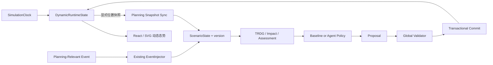

# Phase 6.2 动态任务环境架构

Phase 6.2 在 `Dynamic Environment → DemoApplicationService → P1–P5.1 Core` 边界增加持续任务环境。它生成任务级态势和运行状态，不模拟飞行动力学，也不把动画坐标写进 Validator、Agent、Solver 或 Assessment。

## Planning State 与 Runtime State

| 状态 | 权威用途 | 更新频率 | 是否递增 `ScenarioState.version` |
|---|---|---:|---:|
| `ScenarioState` | Agent、候选生成、TRDG、全局校核、事务提交 | 规划相关事件或显式同步 | 是 |
| `DynamicRuntimeState` | 节点动画、任务进度、运行状态、等待事件 | 仿真 tick / HTTP polling | 否 |

`DynamicRuntimeState` 记录仿真时间、节点与编队运行位置、成员相对偏移、任务进度、Runtime Status、航迹进度、倍率、等待事件和最近同步时间。前端每 500 ms 读取服务端状态，服务端 `SimulationClock` 是时间权威；浏览器 wall clock 不参与规划版本控制。

每次动态事件应用前，服务先调用 `ScenarioManager.sync_positions(...)`，把当时运行位置形成一个明确、可审计的规划快照。这个同步和事件各自递增一次版本。重构开始前再同步一次，使距离筛选和新航迹使用当前运行位置。普通 tick 只改变 Runtime State，所以模型推理期间不会因动画产生 `STALE_PROPOSAL`。

## 时钟、运动和任务状态

`SimulationClock` 支持 start、pause、resume、reset、step 和 0.5× / 1× / 2× / 5×。显式 `step` 是确定性的；持续运行把服务端经过时间乘以倍率，并限制单次刷新推进量，避免页面长时间不轮询后突然跨越过多状态。

运动模型采用任务航迹折线的弧长插值。编队参考点沿航迹运动，成员位置等于参考点加初始相对偏移，并裁剪到场景边界。节点失效后停在最后运行位置。重构新增成员在当前编队参考点处建立新的相对偏移；第一版明确不模拟真实转场过程。

任务截止时间与有效执行量分开建模。初始任务和动态新增任务的时间窗均为 600 仿真秒；默认有效执行量为 300 仿真秒，因此保留 300 秒用于事件阻塞、在线重构和恢复。任务进度按 `delta_simulation_time / task_execution_budget` 计算，并在 Runtime State 中保存每项任务的 `task_execution_budget`。共享编队的后续任务使用相邻、不重叠的 600 秒窗口。

页面统一标为“任务执行进度（仿真）”。映射规则为：窗口未开始是 WAITING；有硬约束缺口是 BLOCKED；重构中的受阻任务是 RECONSTRUCTING；提交后短暂为 RECOVERED；编队含降级节点但仍可行时为 DEGRADED；可正常推进时为 EXECUTING；进度达到 100% 后为 COMPLETED。任务超过时间窗且未完成时，界面明确显示“超时未完成（仿真）”。这些值不覆盖 Domain Task 的 ACTIVE / CANCELLED 生命周期。

## 约束引导场景生成

`DynamicScenarioGenerator` 先生成任务需求，再给每个编队配置满足 sensor / relay / navigation 需求的成员，最后生成备用节点、目标和直达航迹。生成结果必须通过领域模型结构校验和 `ReconstructionPrimitives.get_outstanding_violations` 初始可行性检查后才返回。

默认规模是 60 节点、8 任务、6 编队；高级配置支持 30 / 60 节点和 4 / 8 任务。30 节点配置使用 4 个编队以保留真实备用资源池。同一 `scenario_seed` 产生相同定义，不同 seed 改变节点位置、编队空间位置、任务目标、备用资源位置与路线。场景 ID 和节点 ID 仍采用稳定的序号命名，便于审计；算法不依赖固定 U17/U21/R05。

## 事件采样与难度

`DynamicEventSampler` 只生成现有事件模型。语义采样使用有界候选搜索，最多检查 40 个候选，不靠无限拒绝采样。

| 难度 | 构造与验收语义 |
|---|---|
| L1 | 降级一个有冗余的能力提供者；TRDG 可传播影响，但没有硬约束失败，无需重构 |
| L2 | 使单个局部编队的唯一 navigation 节点失效；存在原位修复候选 |
| L3 | L2 节点失效加一条真实航迹上的限制区域；至少形成能力/编队与航迹两类问题 |
| L4 | 选择共享编队任务，制造局部方案会连带破坏另一任务的 Validator feedback 机会 |

手动事件还支持 NodeFailure、NodeDegradation、RestrictedAreaAdd / Remove、TargetMove、TaskAdd、TaskCancel 和 TaskPriorityChange。无法在当前状态构造指定语义时返回 `CHALLENGE_NOT_AVAILABLE`，不会放松 Validator。

## 持续会话、排队与回放

`DynamicMissionSession` 长期关联一个规划会话，保存双 seed、Runtime State、事件、影响结果、重构 run ID、时间线、检查点和指标。重构期间到达的新事件进入 `pending_dynamic_events`；当前事务完成后顺序应用，避免并发修改候选的 base version。

每次创建、步进、事件和重构完成都会保存 Runtime Checkpoint。`artifacts/phase62/dynamic/<run_id>.json` 包含初始/最终 Planning State、事件、影响结果、重构引用、时间线、指标和检查点。前端回放只读取这些记录，不重新调用模型。

REST 前缀为 `/api/v1/dynamic`，提供 session、start、pause、resume、step、speed、event、reconstruct、sync、reset、save、state、timeline、runs 和 run。动态适配层最终调用既有 `DemoApplicationService`，后者继续使用原 EventInjector、TRDG、P3 primitives、Agent Policy、Global Validator 和事务提交。

## 已知限制

这是二维任务态势动态仿真。运动是运动学插值，不含速度约束、加速度、姿态、碰撞、通信链路传播、动态能耗、编队几何稳定性、转场时间或真实任务效能。任务进度不进入 P4 硬约束。运行会话保存在单进程内存中，进程重启后只能读取持久化回放。HTTP polling 适合当前 Demo 规模，不是大规模实时遥测协议。
