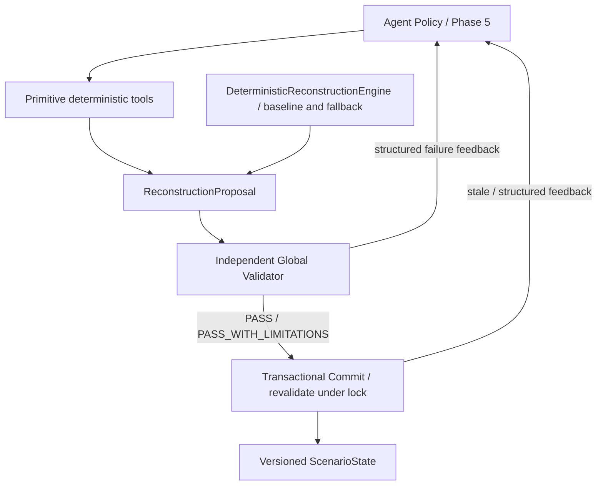

# Phase 2–4 独立能力接口与控制边界

本补充维持 Phase 4 验收目标。GlobalConstraintValidator、ProposalMaterializer、事务 Commit、
版本保护、Rollback、Idempotency 均保持原实现。本阶段没有实现 Agent Policy 或模型工具调用。

`DeterministicReconstructionEngine` 定位为 deterministic baseline、model API 不可用时的
fallback、regression test engine，以及后续 Agent Policy 的对比基线。
它不是唯一高层控制入口；模型 API 检测和自动 fallback 选择策略留在 Phase 5。
现有 `/reconstruct` 保持其确定性行为与默认提交规则，未来 Agent 不必调用它。



## 轻量 Python 接口

入口：`backend.app.reconstruction.primitives.ReconstructionPrimitives`。
只封装现有 Phase 2–4 模块：省去调用者手动准备 scope、ledger 和空 trace，
没有复制候选/求解/验证算法，也没有自动选策略、升级层级、选定候选或隐式提交。

```python
tools = ReconstructionPrimitives(store=manager)  # store 仅用于 commit
observed = manager.get(session_id).state
assessments = tools.assess_current_task_state(observed)
violations = tools.get_outstanding_violations(observed)
attempt = tools.try_in_place_repair(observed, "T03")
# 调用者决定采用哪个 option、请求另一层策略、重规划路线，或停止。
```

| 能力 / 方法 | 输入 | 返回 / 复用实现 |
|---|---|---|
| inspect / assess current state：`assess_current_task_state` | ScenarioState | 全部当前 TaskAssessmentResult；Phase 2 TaskAssessmentEngine.full_check |
| `get_outstanding_violations` | ScenarioState | 当前全局 mission 的 ValidationCheck 失败列表；Phase 4 mission_checks |
| `generate_candidates` | state、task_id、gap、level、可选 count_or_resource_gap | CandidateSet；Phase 3 CandidateGenerator |
| `try_in_place_repair` | state、task_id、可选 protected_task_ids | LocalOptionsResult；FormationReconstructor 的 L1 |
| `find_task_reassignment_options` | 同上 | LocalOptionsResult；TaskReconstructor 的 L2 |
| `try_formation_reconstruction` | 同上 | LocalOptionsResult；FormationReconstructor 的 L3 |
| `detect_route_impacts` | state、可选 task_ids（默认全部 ACTIVE） | RouteImpactsResult（requests/decisions）；RouteImpactDetector |
| `replan_route` | state、RouteChangeRequest | RoutePlanResult；RoutePlanner |
| `validate_proposal` | observed state、完整 Proposal | ValidationResult；原 GlobalConstraintValidator |
| `commit_validated_proposal` | session_id、完整 Proposal；初始化时提供 store | CommitReceipt；原 TransactionalReconstructionEngine |

返回均为正式 Pydantic 模型或其列表，可独立序列化。LocalOptionsResult 带
base_state_version/digest、strategy_level、options、search_complete、trace。
没有选项与搜索预算耗尽通过 trace/search_complete 区分；空列表不会自动触发下一层求解。
可直接先调用 L3，不需要先经过 baseline 或 L1/L2。

## 调用者与工具分别负责什么

- 输入是明确的观测或私有工作快照；工具不隐式读取新会话覆盖调用者的上下文。
  候选/局部试探/路线工具在独立副本上运行，不修改传入状态或会话。
- Phase 2 inspection 可返回 KEEP/ADJUST，但不等价于全局合法。outstanding violations
  复用 Phase 4 更严格的当前 mission 检查，可发现仍在 ACTIVE 编队里的 FAILED 节点；
  它不验证尚不存在的 Proposal 的 scope、metadata、Delta 或版本前提。
- `generate_candidates` 的 gap 只是筛选参数，不是降低 Task.requirements 的入口。
  L1/L3 Solver 仍从实际 Task、Formation 和共享任务派生自身约束。
- 局部试探默认保护当前健康任务，调用者可额外指定 protected_task_ids。
  处理多个任务时，调用者必须把选中的 option 应用于自己的私有工作快照，再调用下一项能力；
  各次调用从该快照重建 ledger，不在 facade 中积累隐藏预留状态。
- LocalOption / RoutePlanResult 是方案构建材料，不是完整 Proposal，也不是全局 PASS。
  调用者负责选择、组合和记录策略。现有 `common.apply_option/preview` 可用于私有试探，
  `cost.describe_delta` 与 `DisruptionCostEvaluator` 可用于最终差分/成本描述；
  正式 Proposal 仍需填写现有 scope 扩展理由、before images、元数据和 trace 合约。
  Phase 5 的 Policy/方案组装会使用这些材料，本补充不提前实现 Agent 或新的编排状态机。
- `commit_validated_proposal` 名称表达调用顺序，不会信任调用者的 PASS 或旧 validation_id。
  它始终通过原事务入口在锁内重新验证；过期方案 409、验证失败不写状态、同内容重放不递增版本。

本阶段新增的是 Python 能力接口与正式返回类型，没有扩展十套 HTTP 路由或 Agent ToolRegistry。
已有 propose/validate/commit HTTP 路径继续可用；Phase 5 可按需要将这些独立方法注册为模型工具。
`backend/tests/test_primitives.py` 禁用 baseline 和完整 hierarchical propose 后，分别验证 L1/L2/L3、
候选、路线、独立全局验证及直接事务提交，证明高层确定性引擎不是必经入口。
